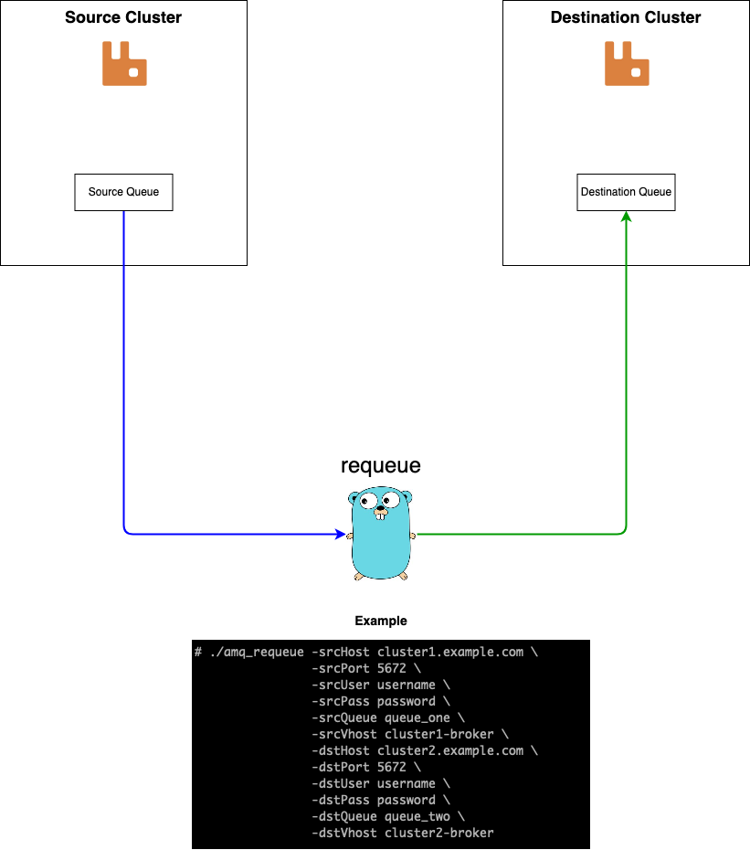

# requeue

* *Language*: Go
* *Description*: A CLI tool to move messages from one AMQ queue/cluster to another



## Build
```
# go build -o amq_requeue *.go
```

## Examples
* Move messages to queues with *no arguments*:
```
# ./amq_requeue -srcHost cluster1.example.com \
                -srcPort 5672 \
	        -srcUser username \
	        -srcPass password \
	        -srcQueue queue_one \
	        -srcVhost cluster1-broker \
	        -dstHost cluster2.example.com \
	        -dstPort 5672 \
	        -dstUser username \
	        -dstPass password \
	        -dstQueue queue_two \
	        -dstVhost cluster2-broker
```

* Move messages to queues with *arguments* and using TLS:
```
# ./amq_requeue -srcHost cluster1.example.com \
                -srcPort 5671 \
                -srcTls \
	        -srcUser username \
	        -srcPass password \
	        -srcQueue queue_one \
	        -srcVhost cluster1-broker \
	        -dstHost cluster2.example.com \
	        -dstPort 5671 \
                -dstTls \
	        -dstUser username \
	        -dstPass password \
	        -dstQueue queue_two \
	        -dstVhost cluster2-broker \
                -sArgs 'x-message-ttl:3600000:int,x-ha-policy:ues-ha-all:string' \
                -dArgs 'x-message-ttl:10800000:int,x-ha-policy:ues-ha-all:string' \
		-verifyTls=true
```

### License
Licensed under the Apache 2.0 License
